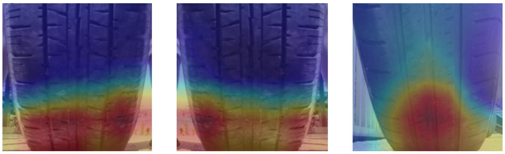

# Efficient Tire Wear and Defect Detection Algorithm Based on Deep Learning
Paper : https://www.koreascience.or.kr/article/JAKO202125761197586.pdf \
Project report : https://scienceon.kisti.re.kr/commons/util/originalView.do

<br/> 

## environment
- cuda 10.2
- python 3.6.12
- torch 1.8.1
- torchvision 0.9.1
- tensorflow 1.14.0
- keras 2.1.0
```
pip install -r requirements.txt
```
<br/> 

## detectDefect
This project is tire defect detection model using [@matterport Mask-RCNN balloon.py](https://github.com/matterport/Mask_RCNN.git). \
and start by reading this [blog post about the balloon color splash sample](https://engineering.matterport.com/splash-of-color-instance-segmentation-with-mask-r-cnn-and-tensorflow-7c761e238b46).


### 1. Create dataset
Generate data Annotation and save JSON file using VGG Image Annotator, [VIA](https://www.robots.ox.ac.uk/~vgg/software/via/). 
Each mask is set of polygon points. 


### 2. Download a pretrained model
You can download pre-trained COCO weights (mask_rcnn_coco.h5) from the [releases page](https://github.com/matterport/Mask_RCNN/releases).

### 3. Train
```
python train.py --command train --weights coco --dataset [path/to/dataset] --image [path/to/image]
```

### 4. Visualize
Visualize bounding box and defect masks
```
python train.py --command splash --weights [path/to/checkpoint] --dataset [path/to/dataset] --image [path/to/image]
```


<br/> 

## detectWear

### 1. Create tread mask
Prepare images and Gaussian tread attention masks. The masks are generated by Mask-RCNN.


### 2. Train
```
python train.py
```

### 3. Test

```
python test.py --resume [path/to/checkpoint]
```

### 4. CAM
```
python cam.py --dataset_path [path/to/dataset] 
              --dataset [path/to/dataset/folder] 
              --model_path [path/to/checkpoint/folder]  
              --model_name [path/to/checkpoint.pth] 
```

